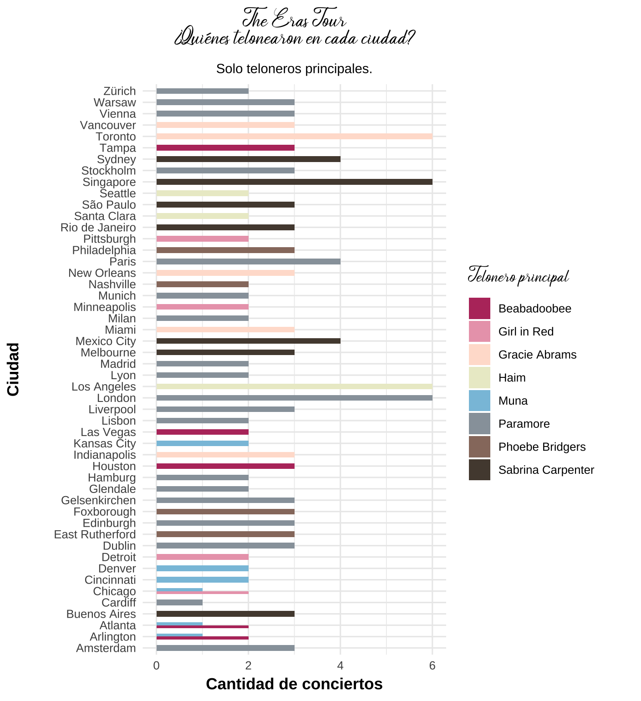

# Analizando bases de datos del Eras Tour de Taylor Swift

Este proyecto analiza una base de datos del Tour mundial realizado por la artista Taylor Swift para realizar distintas funciones en R y Rmarkdown conectarlo con Github.

## Cargamos las librerías a utilizar

```{r}
library(tidyverse) 
library(janitor) 
```

## Cargamos la base de datos

Usamos `read_csv2` para que lea bien el archivo CSV ya que está separado por ";" y de esta forma se ordena directamente en columnas.

```{r}
Taylor_dataset <- read_csv2("data/TaylorDataset.csv")
```

## Limpiamos base de datos

### Revisamos los nombres de las columnas

```{r}
colnames(Taylor_dataset)
```

### Limpiamos los nombres de las columnas

```{r}
Taylor_dataset <- Taylor_dataset |> 
  janitor::clean_names()
```

### Vamos a reducir la base de datos a los datos que queremos revisar

```{r}
Taylor2 <- Taylor_dataset |> 
  select(concert_id, city, date, tick_sales, opener_ar1, opener_ar2, place)
```

### Verificamos la nueva base

```{r}
glimpse(Taylor2)
```

### Exploración de la base de datos

Vamos a revisar cuántos conciertos hubo por ciudad, para esto utilizamos `count()` que arroja el número de ocurrencias en este caso de cuantos conciertos hubo en cada una de las ciudades.

```{r}
Taylor2 |> 
  count(city, sort = TRUE)
```

Veremos qué artistas telonearon como telonero principal y cuántas veces, para esto también utilizamos `count()`:

```{r}
Taylor2 |> 
  count(opener_ar1, sort = TRUE)
```

Y también veremos que artistas telonearon como telonero secundario y cuántas veces.

```{r}
Taylor2 |> 
  count(opener_ar2, sort = TRUE)
```

¿Cuántas entradas se vendieron en promedio? Para esto utilizamos mean.

```{r}
mean(Taylor2$tick_sales, na.rm = TRUE)
```

¿En qué concierto se vendieron más entradas?

```{r}
Taylor2 |> 
  filter(tick_sales == max(tick_sales, na.rm = TRUE)) |> 
  select(city, date, tick_sales)
```

`max(tick_sales, na.rm = TRUE)` nos ayuda a busca el valor máximo de la columna `tick_sales` (ventas de entradas), ignorando los NA si los hay, luego `filter()` selecciona solo las filas donde `tick_sales` es igual a ese valor máximo. Es decir, el concierto con más entradas vendidas. Después de filtrar, `select()` extrae solo las columnas `city`, `date` y `tick_sales` para mostrar la información relevante.

# Visualización de datos

### Telonera/o principal por ciudad en un gráfico de barras

Para los siguientes gráficos, usaremos el paquete `tayloRswift`. Esta librería se instala de la siguiente manera:

```{r}
remotes::install_github("asteves/tayloRswift")
```

Cargamos la librería:

```{r}
library(tayloRswift)
library(showtext)
```

```{r}
df_opener <- Taylor2 |> 
  count(city, opener_ar1) |> 
  filter(!is.na(opener_ar1))

df_opener |> 
  ggplot(aes(x = city, y = n, fill = opener_ar1)) + 
  geom_col(position = "dodge", width = 0.5) + 
  labs(title = "The Eras Tour\n¿Quiénes telonearon en cada ciudad?",
       subtitle = "Solo teloneros principales.", 
       x = "Ciudad", 
       y = "Cantidad de conciertos", 
       fill = "Telonero principal") + 
  scale_fill_taylor(palette = "lover") +
  coord_flip() +
  theme_minimal() +
  theme(
    title = element_text(face = "bold"),
    plot.title = element_text(family = "Soulmate", hjust = 0.5),
    plot.subtitle = element_text(hjust = 0.5),
    legend.title = element_text(family = "Soulmate")
  )
```

¿Qué quiere decir este código?

-   `count(city)`: cuenta cuántas veces aparece cada ciudad en la columna `city`, es decir, cuántos conciertos hubo en cada ciudad. El resultado es un nuevo data frame con dos columnas: `city` y `n` (el número de conciertos).

-   `ggplot(aes(x = reorder(city, n), y = n))`: Crea el gráfico usando `ggplot2` y `reorder(city, n)` ordena las ciudades según el número de conciertos (de menor a mayor). Así el eje x será la ciudad (ordenada), y el eje y será el número de conciertos.

-   `coord_flip()`: Invierte los ejes, para que las ciudades se muestren en el eje vertical y las barras en horizontal para mejorar la legibilidad ya que hay muchas ciudades.

-   `labs()`: Nos sirve para agregar títulos a los ejes.

-   `theme_minimal()`: La damos el aspecto al gráfico.



## Teloneros totales en un gráfico de barras.

```{r}
df_teloneros_total <- Taylor2 |> 
  pivot_longer(cols = c(opener_ar1, opener_ar2), 
               names_to = "tipo_telonero", 
               values_to = "telonero") |> 
  filter(!is.na(telonero)) |> 
  count(city, telonero) |> 
  group_by(city) |> 
  mutate(total = sum(n)) |> 
  rowwise() |> 
  mutate(porc = n/total)

df_teloneros_total |>
  ggplot(aes(x = city, y = porc, fill = telonero)) +
  geom_col(position = "stack") +
  labs(title = "¿Quiénes telonearon por ciudad?",
       x = "Ciudad",
       y = "Cantidad de conciertos",
       fill = "Artista telonero") +
  scale_fill_taylor(palette = "lover") +
  coord_flip() +
  theme_minimal() +
  theme(
    title = element_text(face = "bold"),
    plot.title = element_text(family = "Soulmate", hjust = 0.5),
    plot.subtitle = element_text(hjust = 0.5),
    legend.title = element_text(family = "Soulmate")
  )

```

En este gráfico se añaden dos pasos más a los anteriores:

-   `pivot_longer()`: Convierte las columnas `opener_ar1` y `opener_ar2` (los teloneros) en una sola columna llamada telonero. Esto permite analizar todos los teloneros juntos, **sin importar si fueron el primero o el segundo**.

-   `filter(!is.na(telonero))`: Elimina las filas donde no hay telonero (es decir, valores NA).


## Cantidad de conciertos por ciudad en un gráfico de barras

```{r}
Taylor2 |> 
  count(city) |> 
  ggplot(aes(x = reorder(city, n), y = n)) + 
  geom_col(fill = "#b8396b") + 
  coord_flip() + 
  labs(title = "Cantidad de conciertos por ciudad", 
       x = "Ciudad", 
       y = "Número de conciertos") + 
    theme_minimal() +
  theme(
    title = element_text(face = "bold"),
    plot.title = element_text(family = "Soulmate", hjust = 0.5),
    plot.subtitle = element_text(hjust = 0.5),
    legend.title = element_text(family = "Soulmate")
  )
```


En este gráfico se realizan los mismos pasos anteriores, pero `geom_col(fill = "#b8396b")` dibuja las barras del gráfico con color rosado.

## Conclusión

Este trabajo permitió revisar visualmente las ciudades en que se realizaron conciertos de Taylor Swift, eventualmente se podía generar un mapa para mejorar esta visualización. La base de datos estaba ordenada por lo que fue sencillo trabajar con ella y no fue necesario realizar tantos ajustes, por lo que se optó por simplificar en términos de cantidad de datos principalmente.

Respecto a los datos se pudo revisar que la ciudad con más ventas fue Arlington y además, la revisión de teloneros se complejizaba por dos razones:

-   La división de teloneros entre principales y secundarios hace que se repitan, por lo que aumenta la dificultad de interpretación.

**Gracias por revisar este análisis de datos del Tour Mundial "Eras" de Taylor Swift**.

> La base de datos fue obtenida desde la página [Kaggle](https://www.kaggle.com/datasets/tymonbot/taylor-swift-eras-toure?resource=download).
